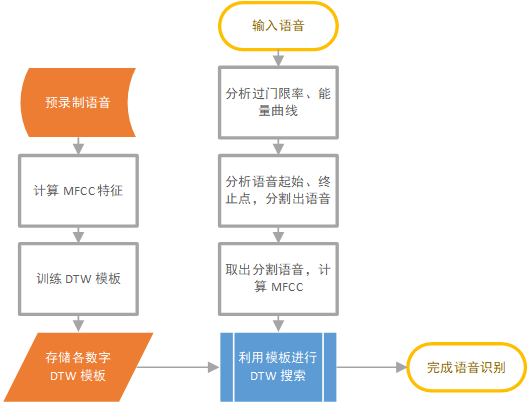
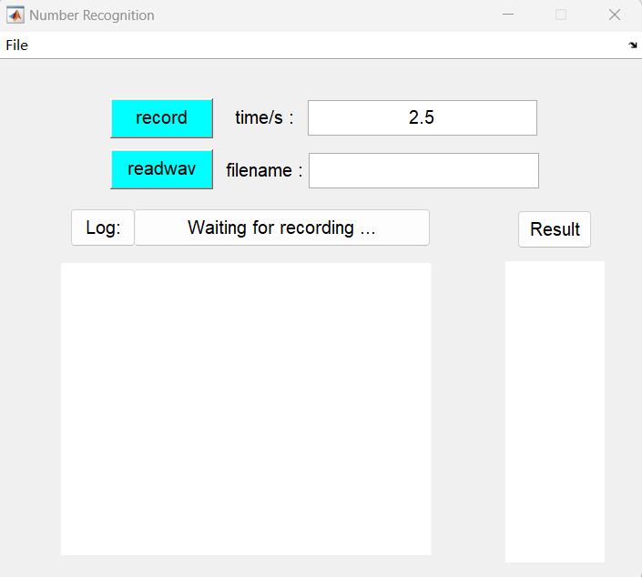

# 语音数字串识别器说明文档

---

## 系统说明

该系统工作流程图如下

各部分关键参数及简要说明如下。 

**预处理阶段**：

- 预录制语音为单个数字的语音，从 0 - 9 共 10 组，采样率 16 kHz
- 计算 MFCC 特征中，Mel 滤波器组个数 40，取输出前 18 维（不计直流分量）作为 MFCC 特征；分析窗采用汉明窗
- 训练 DTW 模板中，时间上保存 5 个 MFCC 特征作为单个数字的 DTW 模板

**语音识别阶段**：

- 分析过门限率中，门限设为噪声功率的 6 倍；分析帧长 20 ms，帧移 10 ms
- 分析语音起始、终止过程中，设定语音长度至少为 10 帧；分析语音起始点，采用过门限率和能量曲线共同判断。过门限率连续 9 帧不为 0 视为语音开始；能量首次超过 6 倍噪声功率视为语音开始。分析终止过程时，从语音起始点出发，当能量首次连续 6 帧低于 6 倍噪声功率视为语音结束。
- 计算 MFCC 与训练时相同，Mel 滤波器组个数 40，取输出前 18 维（不计直流分量）作为 MFCC 特征；分析窗采用汉明窗
- 对每段分割的语音计算完 MFCC 特征后，与模板进行对比，即进行 DTW 搜索，取 DTW 距离最小者为该段语音的识别结果

## 使用方式

主界面如下

点击 `record`，等待 log 显示 `Starting recording` 后，再等待约 0.5 s，即可开始录音; 或输入音频路径，点击 `readwav`，即开始识别。

## 文件说明

`functions/`：函数文件

`speech_recognition/`：程序文件；直接运行 `gui.m` 打开图形化界面即可

`resource/`：资源文件，包含训练数据与测试数据

